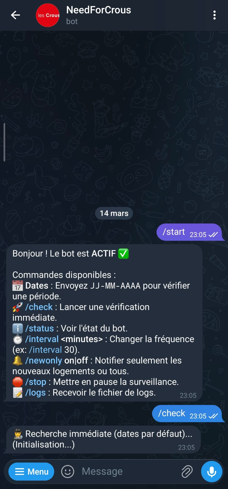
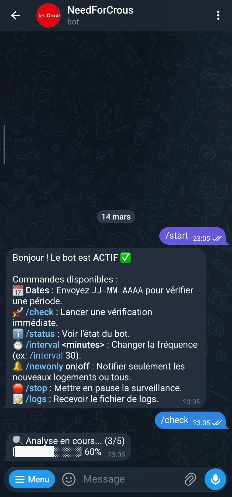
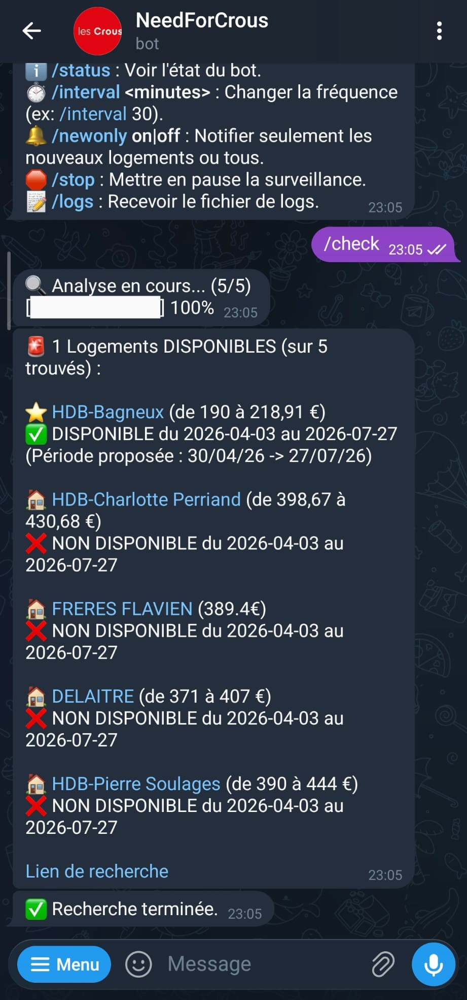

<div align="center">


</div>

# 🏎️ Need for Crous : Le Bot de Notification Logement CROUS

Un bot Telegram intelligent qui surveille automatiquement le site [TrouverUnLogement](https://trouverunlogement.lescrous.fr/) du CROUS et vous notifie dès qu'un logement se libère.

Ce projet peut fonctionner comme un script Python classique, via Docker, ou comme une application autonome (`.exe`) sous Windows.

🌐 Site du projet : [ahmed-ghemari.me/NeedForCrous](https://ahmed-ghemari.me/NeedForCrous/)

## 📸 Screenshots

<p align="center">
   
   
   
</p>

## ✨ Fonctionnalités

- **Surveillance Automatique** : Vérifie périodiquement la disponibilité (intervalle configurable).
- **Bot Telegram Interactif** : 
  - Recevez des alertes en temps réel avec lien direct.
  - Contrôlez le bot via des commandes (`/check`, `/stop`, `/interval`).
  - Changez l'intervalle de vérification à la volée (`/interval 10`).
   - Choisissez si les notifications auto envoient seulement les nouveaux logements (`/newonly on|off`).
- **Gestion de Session Avancée** :
  - Conserve la connexion (cookies) pour éviter les captchas et les connexions répétées.
  - Détecte l'expiration de session et se reconnecte automatiquement (via SSO ou login complet).
- **Mode Discret** : Utilise des techniques anti-détection (Selenium Stealth) pour contourner les blocages du CROUS.
- **Support Docker** : Déploiement facile sur serveur ou NAS.
- **Builder Windows interactif (PowerShell)** :
   - Vérifie/crée `.env` depuis `.env.template` et vous guide variable par variable.
   - Après le choix de mode, propose (flèches `↑/↓` + `Entrée`) de copier soit `.env`, soit `.env.template`.
   - Compile l'exécutable puis copie la config de distribution (`.env.template` par défaut, `.env` si choisi ou via `--include-env`).

---

## 🚀 Installation & Démarrage Rapide

Pour que le bot fonctionne, suivez ces étapes **dans l'ordre**.

### 1️⃣ Récupération & Configuration

1. **Clonez le projet** (ou téléchargez le ZIP et extrayez-le) :
   ```bash
   git clone https://github.com/kira-mari/NeedForCrous.git
   ```
2. **Créez votre fichier de configuration** :
   - À la racine du dossier, créez un fichier nommé `.env`.
   - Copiez-y le contenu détaillé dans la section [⚙️ Configuration](#%EF%B8%8F-configuration-fichier-env) (plus bas).
   - Remplissez vos identifiants CROUS et Telegram.

### 2️⃣ Lancement du Bot

Une fois configuré, choisissez votre méthode de lancement :

#### Option A : Générer l'Exécutable Windows (Recommandé)

1. **Supprimez toute instance existante**
   Si c'est une mise à jour ou si le bot tourne déjà, fermez-le d'abord pour éviter les conflits :
   ```powershell
   taskkill /F /IM NeedForCrous.exe
   ```

2. **Créez l'exécutable**
   Méthode simple (double-clic) :
   - Double-cliquez sur `build_exe.bat`.

   Méthode terminal (équivalent) :
   ```powershell
   .\build_exe.bat
   ```

   Mode avancé (appel direct du script PowerShell) :
   ```powershell
   powershell -NoProfile -ExecutionPolicy Bypass -File .\build_exe.ps1 --quiet
   powershell -NoProfile -ExecutionPolicy Bypass -File .\build_exe.ps1 --verbose
   powershell -NoProfile -ExecutionPolicy Bypass -File .\build_exe.ps1 --include-env
   ```

   En mode interactif, le wizard vous demande ensuite quoi copier dans `dist/` :
   - `.env` (contient vos secrets)
   - `.env.template` (recommandé pour partager le build)
   Navigation au clavier : flèches `↑/↓` puis `Entrée`.

3. **Lancez le Bot**
   - Un dossier `dist/` a été créé.
   - Par défaut, le script copie `.env.template` vers `dist/.env.template` (plus sûr pour partager le build).
   - Vous pouvez choisir `.env` directement dans le menu interactif, ou forcer ce comportement via `--include-env`.
   - Lancez `NeedForCrous.exe` (gardez la fenêtre ouverte).
   - Sur Telegram, tapez `/start`.

#### Option B : Lancement Direct (Python)

Pour les développeurs ou ceux qui préfèrent ne pas compiler.

1. Installez **Poetry** (gestionnaire de dépendances).
2. Installez les librairies :
   ```bash
   poetry install
   ```
3. Activez l'environnement et lancez :
   ```bash
   poetry shell
   python main.py --listen
   ```

#### Option C : Docker

1. Construisez l'image :
   ```bash
   docker build -t crous-bot .
   ```
2. Lancez le conteneur (votre fichier .env est lu automatiquement) :
   ```bash
   docker run -d --env-file .env crous-bot
   ```

---

## ⚙️ Configuration (Fichier .env)

Créez un fichier `.env` à la racine du projet avec le contenu suivant (respectez scrupuleusement ces noms de variables) :

```ini
# Identifiants CROUS (Messervices.etudiant.gouv.fr)
MSE_EMAIL=votre_email@exemple.com
MSE_PASSWORD=votre_mot_de_passe

# Configuration Telegram
# Créez un bot via @BotFather pour obtenir le token
TELEGRAM_BOT_TOKEN=123456789:ABCdefGHIjklMNOpqrsTUVwxyz
# Votre ID personnel (obtenez-le par @userinfobot)
MY_TELEGRAM_ID=987654321

# URL de recherche (Faites une recherche sur le site, copiez l'URL)
SEARCH_URL=https://trouverunlogement.lescrous.fr/tools/36/search?bounds=...

# Optionnel - Fenêtre de dates par défaut (YYYY-MM-DD)
DATE_FROM=2026-09-01
DATE_TO=2027-06-30
```

---

## 🤖 Commandes du Bot Telegram

Une fois le bot lancé, vous pouvez lui parler directement sur Telegram :

| Commande | Description |
| :--- | :--- |
| `/start` | 🟢 Active la surveillance et affiche l'aide. |
| `/stop` | ⏸️ Met en pause la surveillance automatique. |
| `/check` | 🚀 Lance une vérification **immédiate** des logements. |
| `/status` | ℹ️ Affiche l'état (Actif/Pause, prochaine vérification). |
| `/interval X` | ⏱️ Change la fréquence de vérification à X minutes (ex: `/interval 15`). |
| `/newonly on|off` | 🔔 Active/désactive le mode "nouveaux logements uniquement" pour les checks automatiques. |
| `/logs` | 📄 Envoie le fichier de log pour débogage. |
| `15-04-2026` | 📅 Vérifie la disponibilité pour une date précise. |

---

## 🛠️ Dépannage

- **Erreur de connexion / Cookies** : 
  Le bot gère désormais automatiquement l'expiration de session. S'il échoue plusieurs fois, il supprimera automatiquement ses cookies et tentera une reconnexion propre.
  
- **Le navigateur se ferme tout seul ?**
  C'est normal en mode "headless" (sans tête). Le bot ouvre le navigateur, vérifie, et le ferme pour économiser les ressources.

- **Doublons de notifications ?**
  Assurez-vous de n'avoir qu'une seule instance du programme lancée.

- **Erreur de build sur le nettoyage du dossier `dist` ?**
   Si un fichier est verrouillé (ex: `crous_bot.log`), fermez les instances en cours (`NeedForCrous.exe`, terminals, éditeurs qui lisent le fichier) puis relancez `build_exe.bat`.

---

## 📝 Licence

Distribué sous licence MIT.
